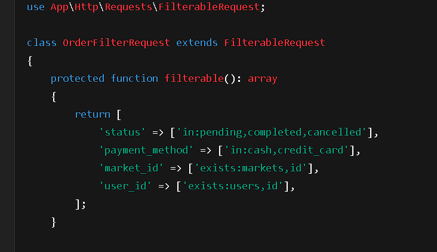

📄 FilterableRequest System Documentation
Overview
FilterableRequest is a base abstract request class for handling dynamic filtering in API requests.

It provides a centralized, scalable, and secure way to:

Validate user filters based on roles and/or permissions.

Apply different validation rules depending on who is making the request.

Keep models and controllers clean from complex validation logic.

📚 How It Works

Step	Description
1	Define available filter fields and validation rules in the request class.
2	Optionally define role-based or permission-based allowed fields.
3	FilterableRequest dynamically builds validation rules based on the current user.
4	Unauthorized filters are automatically blocked.
5	Custom error messages are provided for clean API responses.
🛠 Core Methods (Responsibilities)

Method	Responsibility
filterable()	Child class must define all fields available for filtering + their validation rules.
roleFilters()	Child class can define allowed fields for each role (optional).
permissionFilters()	Child class can define allowed fields based on permissions (optional).
authorize()	Ensure the user is authenticated.
rules()	Build dynamic validation rules based on user's permissions, fallback to roles.
messages()	Define custom error messages for validation failures.
🧩 Example Usage
1. Create a Custom Filterable Request
php
Copy
Edit
<?php

namespace App\Http\Requests\Order;

use App\Http\Requests\FilterableRequest;

class OrderFilterRequest extends FilterableRequest
{
    protected function filterable(): array
    {
        return [
            'status' => ['in:pending,completed,cancelled'],
            'payment_method' => ['in:cash,credit_card'],
            'market_id' => ['exists:markets,id'],
            'user_id' => ['exists:users,id'],
        ];
    }

    protected function roleFilters(): array
    {
        return [
            'admin' => ['status', 'payment_method', 'market_id', 'user_id'],
            'market' => ['market_id', 'status'],
            'user' => ['user_id'],
        ];
    }

    protected function permissionFilters(): array
    {
        return [
            'view-orders' => ['status', 'payment_method', 'market_id', 'user_id'],
        ];
    }
}
2. Use in Controller
php
Copy
Edit
public function index(OrderFilterRequest $request)
{
    $validated = $request->validated(); // Only allowed and validated filters

    $query = Order::query();

    foreach ($validated['filter'] ?? [] as $field => $value) {
        $query->whereIn($field, explode(',', $value));
    }

    return $query->get();
}
🎯 Behavior Summary
If user has permissions: use permissionFilters().

Else if user has role: use roleFilters().

Else: no filters allowed.

All inputs validated based on filterable() field rules.

No unauthorized access to unapproved fields.

No code duplication between models or controllers.

📦 Benefits

Benefit	Why It Matters
Clean structure	Filters and rules live inside their dedicated request class.
Easy maintenance	Update one place, affect all related code.
Security	Prevent users from sending invalid or unauthorized filters.
Extensible	Easily add new models, roles, or permissions.
Separation of concerns	Validation is separated from business logic.
⚡ Best Practices
Always define clear filter fields in filterable().

Prefer permission-based control over roles if possible (more flexible).

If mixing filters and relationships (e.g., user->orders), handle that separately in your query logic.

Keep validation simple inside requests; keep query-building separate inside services or repositories.
--------------------------------------
Example usage in Filter Request classes

